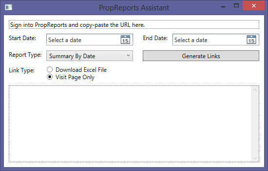

# PropReportsAssistant
Creates links for visiting PropReports pages, one month at a time.

This tool makes viewing monthly reports easier by building the links for each month instead of having to manually chose the start and end dates for each month on the website. To use:

1. Sign into PropReports and copy-paste the URL into the program. This tells the program what the links should look like. 
2. Fill in the date range of when you would link monthly reports, as well as your report type settings. 
3. Press the Generate Links button to see a list of links for monthly reports. Click on the links.

To download, visit this link and press Download:

https://github.com/kriscode1/PropReportsAssistant/blob/master/PropReportsAssistant/bin/Release/PropReportsAssistant.exe

Program written in C# with .NET and WPF. 
